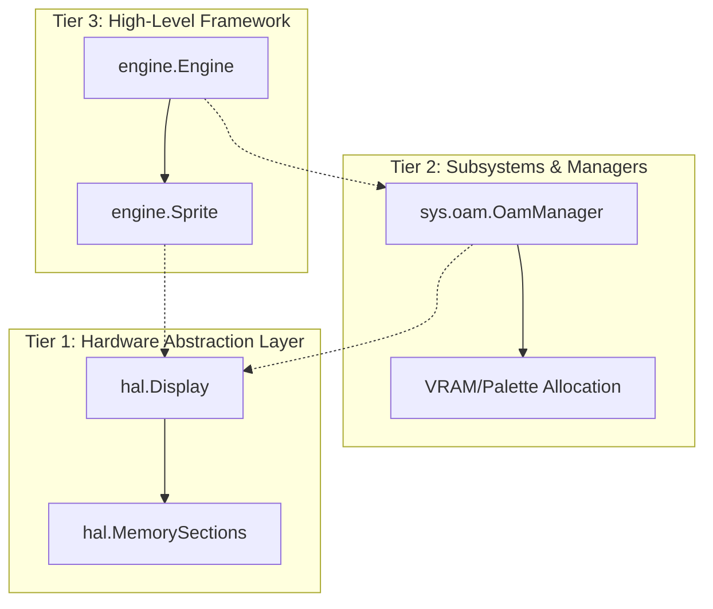

# Zamgba SDK Architectural Design

The Zamgba SDK utilizes a structured, **3-Tier Architecture** to bridge the low-level, bare-metal hardware of the Game Boy Advance (GBA) with a highly productive, expressive 2D game engine experience.

---

---

## 1. Tier 1: Hardware Abstraction Layer (HAL) — `zamgba.hal`

The foundation of the SDK. It directly wraps GBA hardware features, I/O registers, memory sections, and hardware timing routines.

*   **`hal.MemorySections`**: Defines raw memory-mapped GBA segments (VRAM, EWRAM, PALRAM, OAM).
*   **`hal.Display`**: Safe abstractions for configuring display modes (Mode 0-5) and background/object capabilities (e.g., `setMode0()`, `setObject()`).
*   **`hal.waitForVBlank()`**: Reads the hardware scanline register `REG_VCOUNT` and blocks execution safely until the vertical blanking phase begins, which is the only safe window to modify graphics memory without visual tearing.

---

## 2. Tier 2: Subsystems & Managers — `zamgba.sys`

Acts as a performance-minded middleman. It manages limited hardware assets (such as the GBA's strict limit of 128 hardware sprites and 96KB of VRAM) using double-buffering and shadow memories to keep gameplay fast and fluid.

*   **`sys.oam.ObjAttr`**: Represents the tightly packed 64-bit GBA hardware object configuration (position, shape, palette bank, tile index).
*   **`sys.oam.OamManager`**: 
    *   Holds an internal software mirror buffer (`shadow: [128]ObjAttr`) in fast system work RAM (EWRAM).
    *   **`init()`**: Sets up initial offscreen sprite values to clear hardware garbage data.
    *   **`copyToHardware()`**: Synchronizes the staging mirror buffer directly to the real GBA hardware OAM memory during VBlank.

---

## 3. Tier 3: High-Level Framework — `zamgba.engine`

The developer-facing framework. It abstracts away hardware bitfiddling, memory-offsets, and register-synchronization, offering high-level concepts for scene management, object-oriented/procedural drawing, and game loops.

*   **`engine.Sprite`**: High-level game entity containing logical properties (`x: i32`, `y: i32`, `width: u32`, `height: u32`). It exposes `toOamAttr()` to auto-encode logical sizes into the hardware attribute bitmasks.
*   **`engine.Engine`**: 
    *   Manages game frame lifecycles, and automatically translates engine-level graphics requests down to Tier 2 subsystems.
    *   **`drawSprite(spr)`**: Hides manual index mapping (e.g., slot `0`) by automatically allocating the next available hardware slot from the GBA's 128 available channels.
    *   **`nextFrame()`**: Bundles frame timing (`hal.waitForVBlank()`), graphics commits (`oam.copyToHardware()`), and sprite slot allocator resets into a single call.
    *   **`run(context)`**: The compile-time generic run loop runner. It accepts either:
        1.  **Static Namespaces (`@This()`)**: To run file-struct layouts where state is declared cleanly as file-scope `var` globals.
        2.  **Instance Pointers (`&game`)**: To run fully encapsulated structs, supporting save state serialization (SRAM/Flash) and multiple scenes.

---

## 4. Key Design Tradeoffs

1.  **Static vs. Instanced State Loops**: Supporting both styles in `Engine.run` allows beginners to prototype self-contained menus and levels instantly via `@This()` singletons, while providing a frictionless upgrade path to instanced structs when developing larger games with carry-over player variables and SRAM saving.
2.  **Monomorphized Generics**: By leveraging Zig’s compile-time types (`anytype` and `@hasDecl`), the Engine’s loop resolves entirely at compile-time. There are zero virtual tables (vtables), dynamic dispatch offsets, or pointer wrappers compiled into the final ROM, maintaining optimal performance for the GBA's 16.78 MHz CPU.
